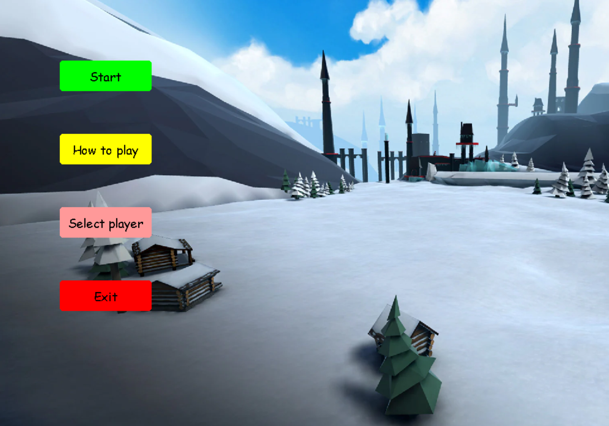
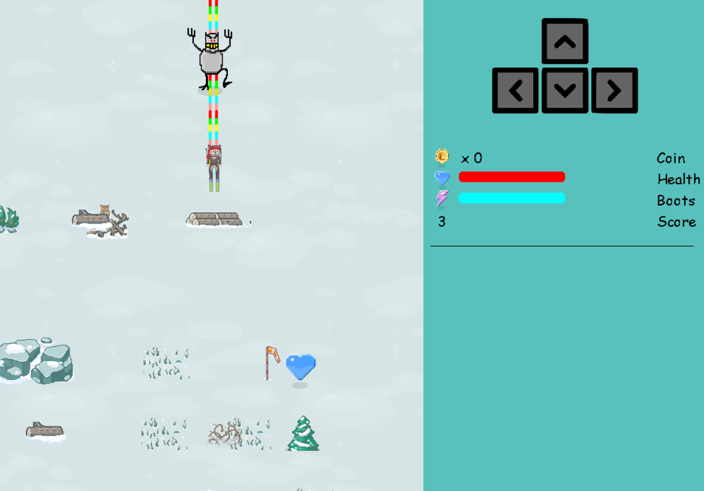
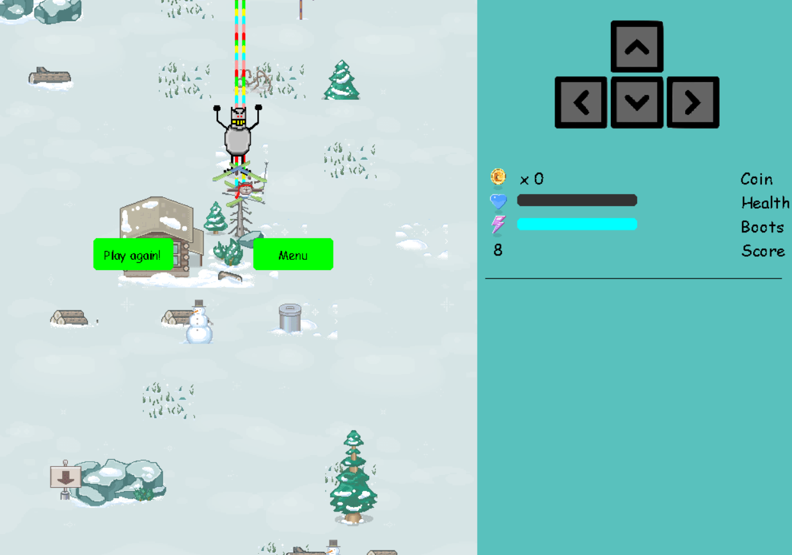

# Surf-by-Python
Make a simple game using Python

## How to play
- Using arrow key to move the character.
- Don't touch any obstacle in his path.
- Wining game when you get the target.

## Demo gameplay

